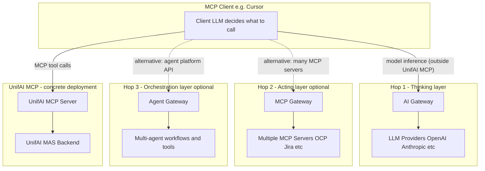

# Gateway Comparison: AI Gateway vs MCP Gateway vs Agent Gateway vs UnifAI MCP

This document compares four related concepts that often get conflated in agentic AI architecture discussions:

| Concept | What it typically is |
|---------|----------------------|
| **AI Gateway** | Infrastructure product/pattern for LLM provider traffic |
| **MCP Gateway** | Infrastructure product/pattern for agent-to-tool MCP traffic |
| **Agent Gateway** | Emerging infrastructure pattern for multi-step agent workflow execution |
| **UnifAI MCP** | A concrete MCP server that acts as Red Hat's single entry point into UnifAI capabilities |

**Important framing:** AI Gateway, MCP Gateway, and Agent Gateway describe **traffic governance layers**. UnifAI MCP is a **deployed MCP server** that implements some gateway-like behavior for clients (Cursor, Claude Desktop, etc.) but is not a general-purpose replacement for enterprise gateway products.

Sources used for industry definitions include [Traefik](https://traefik.io/glossary/api-gateway-vs-ai-gateway-vs-mcp-gateway), [Zuplo](https://zuplo.com/learning-center/three-gates-ai-infrastructure-api-ai-mcp-gateway), [DigitalAPI](https://www.digitalapi.ai/blogs/ai-gateway-vs-mcp-gateway-vs-api-gateway), [Kong](https://konghq.com/blog/learning-center/what-is-a-mcp-gateway), [Microsoft MCP Gateway docs](https://microsoft.github.io/mcp-gateway/), and the [MCP specification](https://modelcontextprotocol.io/specification/2025-06-18/basic/transports). UnifAI MCP capabilities are verified against this repository's `README.md` and `src/unifai_mcp/`.

---

## 1. Where each option sits in the stack



**Reading the diagram:**

- The **client LLM** (e.g. Cursor's model) sits above all gateway layers. It decides when to call tools.
- An **AI Gateway** governs traffic between applications and LLM providers. UnifAI MCP does not replace this.
- An **MCP Gateway** sits in front of *multiple* MCP servers and governs tool-level access. UnifAI MCP is itself *one* MCP server, not a proxy in front of many.
- An **Agent Gateway** orchestrates multi-step, stateful agent workflows. UnifAI MCP delegates that orchestration to the UnifAI backend via `run_workflow`.
- **UnifAI MCP** is the single MCP endpoint users configure in Cursor; behind it, UnifAI runs multi-agent workflows, resource management, and Red Hat SSO.

---

## 2. One-sentence definitions

| Option | Definition |
|--------|------------|
| **AI Gateway** | A reverse proxy/control plane for LLM API traffic: routing across providers, token budgets, prompt guardrails, semantic caching. ([Traefik](https://traefik.io/glossary/api-gateway-vs-ai-gateway-vs-mcp-gateway), [Zuplo](https://zuplo.com/learning-center/three-gates-ai-infrastructure-api-ai-mcp-gateway)) |
| **MCP Gateway** | A reverse proxy/control plane in front of MCP servers: tool discovery, tool-level RBAC/TBAC, session affinity, credential brokering, audit of every tool call. ([Kong](https://konghq.com/blog/learning-center/what-is-a-mcp-gateway), [Microsoft](https://microsoft.github.io/mcp-gateway/)) |
| **Agent Gateway** | A workflow execution layer for autonomous agents: multi-step orchestration, stateful sessions, retries, human-in-the-loop, agent-to-agent coordination, execution tracing. ([DEV Community / Hadil](https://dev.to/hadil/ai-gateway-vs-mcp-gateway-vs-agent-gateway-what-each-one-does-and-when-you-actually-need-them-33po), [DigitalAPI](https://www.digitalapi.ai/blogs/ai-gateway-vs-mcp-gateway-vs-api-gateway)) |
| **UnifAI MCP** | Red Hat's MCP server exposing UnifAI workflows and platform APIs as MCP tools, with OAuth/SSO, session history, resource CRUD, and workflow lifecycle management. (This repo) |

**Terminology note:** "Agent Gateway" is **emerging and less standardized** than AI Gateway or MCP Gateway. DigitalAPI notes that agent gateway capabilities often overlap with MCP gateway in current stacks. Treat it as a useful mental model, not a fixed product category.

---

## 3. Master capability comparison

Legend: **Yes** = first-class, native capability · **Partial** = some support or delegated · **No** = not in scope · **N/A** = not applicable to this role

### 3.1 Traffic, protocol, and scope

| Capability | AI Gateway | MCP Gateway | Agent Gateway | UnifAI MCP |
|------------|:----------:|:-----------:|:-------------:|:----------:|
| **Primary traffic governed** | App → LLM providers | Agent/client → MCP servers | Agent → multi-step workflows | MCP client → UnifAI platform |
| **Protocol focus** | LLM HTTP APIs (OpenAI-compatible, etc.) | MCP JSON-RPC / Streamable HTTP | Platform-specific / agent runtime APIs | MCP Streamable HTTP (`/mcp`) |
| **State model** | Mostly stateless at transport layer | Stateful MCP sessions ([MCP spec](https://modelcontextprotocol.io/specification/2025-06-18/basic/transports)) | Stateful workflow execution | MCP session + UnifAI workflow sessions |
| **Unit of control** | Tokens, model requests | Tool calls, MCP server access | Workflow runs, agent steps | Workflow runs, resources, platform APIs |
| **Typical deployment role** | Org-wide LLM cost/security layer | Org-wide MCP governance layer | Org-wide agent orchestration layer | Single product entry point for UnifAI |
| **Proxies multiple backends** | Yes (many LLM providers) | Yes (many MCP servers) | Yes (many agents/services) | No (one UnifAI backend; many workflows behind it) |
| **Is itself an MCP server** | No | Sometimes (as front door) | Rarely | **Yes** |

### 3.2 Model / inference layer (AI Gateway territory)

| Capability | AI Gateway | MCP Gateway | Agent Gateway | UnifAI MCP |
|------------|:----------:|:-----------:|:-------------:|:----------:|
| Multi-provider LLM routing | Yes | No | Partial | No |
| LLM failover / load balancing | Yes | No | Partial | No |
| Token-level rate limiting | Yes | No | Partial | No |
| Cost budgets per team/app | Yes | No | Partial | No |
| Semantic caching of LLM responses | Yes | No | Partial | No |
| Prompt injection detection | Yes | No | Partial | No |
| PII/secret masking in model I/O | Yes | Partial | Partial | No |

*UnifAI MCP note:* Internal UnifAI agents use LLMs on the backend, but this MCP server does not expose model routing or token governance to the client. That would be an **AI Gateway inside or in front of UnifAI**, not a feature of UnifAI MCP itself.

### 3.3 Tool layer (MCP Gateway territory)

| Capability | AI Gateway | MCP Gateway | Agent Gateway | UnifAI MCP |
|------------|:----------:|:-----------:|:-------------:|:----------:|
| Tool discovery (`tools/list`) | No | Yes | Partial | Yes (exposes ~20 MCP tools) |
| Tool-level RBAC / TBAC | No | Yes | Partial | Partial (user-scoped via SSO; not per-tool ACL product) |
| Filter tools per agent/role | No | Yes | Partial | Partial (all authenticated users see same tool surface) |
| Proxy to multiple MCP servers | No | Yes | Partial | No |
| Session affinity across MCP servers | No | Yes ([Traefik](https://doc.traefik.io/traefik-hub/mcp-gateway/mcp), [Kong](https://konghq.com/blog/learning-center/what-is-a-mcp-gateway)) | Partial | N/A (single server) |
| Credential brokering for downstream tools | No | Yes | Partial | Partial (SSO session cookie to UnifAI backend) |
| Audit log per tool invocation | Partial | Yes | Yes | Partial (server logs; not full SIEM product) |
| Virtual/composed MCP server views | No | Yes | Partial | No |
| OAuth proxy for MCP servers | No | Yes | Partial | Partial (OAuth AS for clients; Identity Service for SSO) |

*UnifAI MCP note:* It exposes coarse-grained tools (`run_workflow`, `create_resource`, etc.), not granular infra tools like `oc get pods`. Fine-grained tool governance for many MCP servers is **MCP Gateway** work; UnifAI MCP is the **single MCP endpoint** that hides that complexity behind workflows.

### 3.4 Workflow / agent layer (Agent Gateway territory)

| Capability | AI Gateway | MCP Gateway | Agent Gateway | UnifAI MCP |
|------------|:----------:|:-----------:|:-------------:|:----------:|
| Multi-step workflow orchestration | No | Partial | Yes | Yes (via `run_workflow` → UnifAI backend) |
| Multi-agent coordination | No | No | Yes | Yes (backend orchestrator + pipeline patterns) |
| Stateful execution across steps | No | Partial (MCP session) | Yes | Yes (UnifAI workflow sessions) |
| Retry / failure recovery | Partial | Partial | Yes | Partial (5-minute poll timeout; backend handles retries) |
| Human-in-the-loop approval | No | Partial | Yes | No (not exposed at MCP layer) |
| Agent-to-agent communication | No | No | Yes | Yes (inside UnifAI workflows) |
| End-to-end execution tracing | Partial | Partial | Yes | Partial (session chat/history) |
| Workflow authoring / lifecycle | No | No | Partial | Yes (`create_workflow`, `validate_workflow`, etc.) |
| Resource/agent building blocks | No | No | Partial | Yes (`create_resource`, catalog, `$ref`) |

### 3.5 Security, auth, and governance

| Capability | AI Gateway | MCP Gateway | Agent Gateway | UnifAI MCP |
|------------|:----------:|:-----------:|:-------------:|:----------:|
| Authentication | Yes | Yes | Yes | Yes (OAuth 2.1 + Red Hat SSO via Identity Service) |
| Authorization | Yes | Yes (tool-level) | Yes (workflow-level) | Yes (user-scoped UnifAI permissions) |
| Dynamic client registration | Rare | Partial | Rare | Yes (in-memory DCR for MCP clients) |
| Enterprise SSO (OIDC/SAML) | Yes | Yes | Yes | Yes (Keycloak via Identity Service) |
| Rate limiting | Yes (requests/tokens) | Yes (tool calls) | Yes | No (not implemented at MCP layer) |
| Prompt/content guardrails | Yes | Partial | Partial | No |
| Zero-trust / default-deny tool access | No | Yes | Partial | Partial |
| Session ownership / IDOR protection | N/A | Partial | Partial | Yes (`user_owns_session` on `get_session_chat`) |
| Secrets kept out of LLM context | Partial | Yes | Partial | Yes (session cookie in side store, not claims) |

### 3.6 Observability, ops, and cost

| Capability | AI Gateway | MCP Gateway | Agent Gateway | UnifAI MCP |
|------------|:----------:|:-----------:|:-------------:|:----------:|
| Token/cost analytics | Yes | No | Partial | No |
| Per-tool call audit trail | No | Yes | Partial | Partial |
| Per-workflow session history | No | Partial | Yes | Yes |
| Centralized policy control plane | Yes | Yes | Yes | No (single-server config) |
| Multi-tenant isolation | Yes | Yes | Yes | Partial (per-user via SSO) |
| Horizontal scale of gateway itself | Yes | Yes | Yes | Partial (state in memory today) |
| Auth state cleanup / TTL sweep | Yes | Yes | Yes | Yes (`sweep_expired` every 5 min) |

---

## 4. UnifAI MCP: what it actually exposes

Verified against `src/unifai_mcp/server.py` and `README.md`.

### 4.1 MCP tool surface (20 tools)

| Category | Tools |
|----------|-------|
| **Discovery & guidance** | `authenticate`, `get_guide` |
| **Workflow execution** | `list_workflows`, `run_workflow`, `get_session_chat`, `list_sessions`, `list_recent_5_sessions` |
| **Resource management** | `list_resources`, `get_resource_details`, `create_resource`, `update_resource`, `delete_resource`, `list_catalog`, `get_element_schema` |
| **Workflow management** | `get_workflow_details`, `get_workflow_schema`, `create_workflow`, `update_workflow`, `validate_workflow`, `delete_workflow` |

### 4.2 Architectural behavior

| Aspect | UnifAI MCP behavior |
|--------|---------------------|
| **Transport** | Streamable HTTP at `/mcp` |
| **Auth flow** | MCP client → local OAuth AS → UnifAI Identity Service → Keycloak SSO → session cookie stored server-side |
| **Client interaction model** | Client LLM chooses tools; high-value action is usually one `run_workflow` call |
| **Backend coupling** | Thin MCP adapter over UnifAI MAS REST API (`/api2`) |
| **Intelligent routing** | `WORKFLOW_HINTS` + silent workflow list on `authenticate` guides the client LLM |
| **Caching** | Blueprint list (5 min TTL), session ownership set (5 min TTL) |
| **Execution model** | Synchronous poll up to 5 minutes; returns final workflow output as string |

### 4.3 Classification: which gateway pattern does UnifAI MCP match?

| Pattern | Match | Explanation |
|---------|:-----:|-------------|
| **AI Gateway** | **No** | Does not route, meter, or guard LLM provider traffic for the MCP client. |
| **MCP Gateway** | **Partial** | Uses MCP and auth, but does not aggregate/govern many MCP servers or enforce tool-level ACLs across a tool estate. |
| **Agent Gateway** | **Strong** | Primary value is delegating multi-agent workflow execution and platform lifecycle to UnifAI. |
| **Product entry-point MCP server** | **Yes** | Best description: single MCP config for users; capabilities expand on the UnifAI side without changing client config. |

**Recommended label:** *Agent Gateway-style MCP entry point* — or more precisely, **"single MCP server acting as UnifAI's capability gateway."**

---

## 5. Interaction patterns compared

### 5.1 MCP Gateway pattern (many tools, client-driven loop)

```
User: "Why is my pod crashing?"
  → Cursor LLM calls get_pods
  → Cursor LLM calls get_logs
  → Cursor LLM calls describe_pod
  → Cursor LLM synthesizes answer
```

- **Pros:** Interactive, granular, client steers each step.
- **Cons:** Many MCP configs or one MCP gateway to manage; client LLM quality limits investigation depth; tool sprawl.

### 5.2 UnifAI MCP pattern (workflow delegation, server-driven investigation)

```
User: "Why is my pod crashing?"
  → Cursor LLM calls run_workflow("OCP Debug", prompt)
  → UnifAI backend agents investigate (logs, KB, Jira, etc.)
  → Cursor receives structured final answer
  → Cursor may edit local code / suggest fixes
```

- **Pros:** One MCP endpoint; specialized multi-agent reasoning; centralized capability updates; enterprise SSO.
- **Cons:** Less interactive probing of live systems from Cursor; large outputs returned as strings; depends on workflow quality on UnifAI side.

### 5.3 Combined pattern (recommended at scale)

```
Cursor LLM
  ├─ AI Gateway          (optional: governs Cursor's own model calls)
  └─ UnifAI MCP          (single entry: workflows + platform)
        └─ UnifAI backend
              ├─ internal AI Gateway (optional: model cost/control for agents)
              ├─ internal MCP/tool integrations (OCP, Jira, AskRH, etc.)
              └─ multi-agent orchestration
```

This matches the industry pattern described by [Zuplo](https://zuplo.com/learning-center/three-gates-ai-infrastructure-api-ai-mcp-gateway) and [Traefik](https://traefik.io/glossary/api-gateway-vs-ai-gateway-vs-mcp-gateway): different hops, different gates. UnifAI MCP collapses **agent gateway + many tool backends** into one user-facing MCP server.

---

## 6. Decision matrix: when to use what

| Your situation | Recommended approach |
|----------------|---------------------|
| Need to control LLM spend, providers, prompt safety for apps calling models directly | **AI Gateway** (LiteLLM, Kong AI, Traefik AI Gateway, etc.) |
| Many MCP servers (OCP, Jira, DB, …) and need tool-level RBAC, audit, credential brokering | **MCP Gateway** (Kong MCP, Traefik MCP, Microsoft MCP Gateway, etc.) |
| Complex autonomous agents with HITL, retries, cross-agent tracing as first-class infra | **Agent Gateway** (emerging products) or **UnifAI** backend orchestration |
| Red Hat users should have **one Cursor MCP config** for AskRH, OCP debug, Jira, web search, etc. | **UnifAI MCP** |
| Production agents calling tools **and** models at scale | **All layers** — AI Gateway + MCP Gateway + orchestration ([Traefik](https://traefik.io/glossary/api-gateway-vs-ai-gateway-vs-mcp-gateway)) |
| UnifAI as enterprise entry point **without** N MCP servers in Cursor | **UnifAI MCP only** at client; add gateways internally as needed |

---

## 7. Coexistence: can they work together?

**Yes.** They govern different hops and are complementary.

| Combination | Relationship |
|-------------|--------------|
| **AI Gateway + UnifAI MCP** | AI Gateway governs Cursor's LLM; UnifAI MCP governs Red Hat capability execution. No overlap. |
| **MCP Gateway + UnifAI MCP** | Usually **either/or at the client**: users configure one MCP endpoint (UnifAI) *or* many tools via MCP Gateway. Internally, UnifAI may still use MCP Gateway patterns for its own tool integrations. |
| **Agent Gateway + UnifAI MCP** | UnifAI MCP **is** the client-facing agent gateway interface; the Agent Gateway function lives in UnifAI MAS backend. |
| **All three + UnifAI MCP** | Common enterprise pattern: AI Gateway for model traffic, UnifAI MCP as the governed product entry point, internal MCP/AI gateways inside the platform. |

---

## 8. Gaps and trade-offs (honest assessment)

### UnifAI MCP strengths

- Single MCP config for rich, cross-domain Red Hat capabilities
- Multi-agent orchestration stronger than a single client LLM tool loop
- Full platform lifecycle (resources, workflows, validation, guides)
- Enterprise SSO aligned with Red Hat identity
- Workflow routing hints reduce user need to know blueprint names

### UnifAI MCP limitations (vs dedicated gateway products)

| Gap | Detail |
|-----|--------|
| Not a multi-MCP proxy | Does not replace MCP Gateway for governing 50 MCP servers |
| No token/cost governance | No visibility or budgets for client LLM usage |
| Coarse MCP tools | ~20 tools vs hundreds of granular `oc`/API tools |
| Client cannot steer each infra call | Investigation is delegated, not interactive at tool level |
| In-memory auth state | Tokens/sessions not persisted; restart clears auth ([README](README.md)) |
| Shared HTTP client | Concurrent users share one `UnifAIClient` instance (session cookie set per request — worth hardening for high concurrency) |

### Industry trend

[Vendors and analysts in 2025–2026](https://www.lunar.dev/post/top-5-ai-gateways-in-2026) describe consolidation toward **unified control planes** that cover model, tool, and agent traffic. UnifAI MCP aligns with the **user experience** side of that consolidation (one entry point) while **not** replacing infra-grade AI/MCP gateway products for platform engineering teams.

---

## 9. Summary table

| Dimension | AI Gateway | MCP Gateway | Agent Gateway | UnifAI MCP |
|-----------|------------|-------------|---------------|------------|
| **Governs** | Models | Tools | Workflows/agents | UnifAI platform access |
| **Sits between** | App ↔ LLM providers | Client ↔ MCP servers | Client ↔ agent runtime | MCP client ↔ UnifAI MAS |
| **Primary risk addressed** | Runaway LLM cost, prompt injection | Unauthorized tool use, credential sprawl | Untraceable agent behavior | Fragmented MCP configs, weak orchestration |
| **Maturity** | High | Medium (rapid growth) | Emerging | Production MCP server (this repo) |
| **Cursor config count** | N/A (not MCP) | 1 gateway + N servers | Varies | **1** |
| **Best for Red Hat vision** | Internal platform ops | Internal tool governance | Backend orchestration | **External user entry point** |

---

## 10. References

### Industry definitions

- Traefik — [API Gateway vs AI Gateway vs MCP Gateway](https://traefik.io/glossary/api-gateway-vs-ai-gateway-vs-mcp-gateway)
- Zuplo — [The Three Gates of AI Infrastructure](https://zuplo.com/learning-center/three-gates-ai-infrastructure-api-ai-mcp-gateway)
- DigitalAPI — [AI Gateway vs MCP Gateway vs API Gateway](https://www.digitalapi.ai/blogs/ai-gateway-vs-mcp-gateway-vs-api-gateway)
- Kong — [What is an MCP Gateway?](https://konghq.com/blog/learning-center/what-is-a-mcp-gateway)
- Microsoft — [MCP Gateway documentation](https://microsoft.github.io/mcp-gateway/)
- DEV Community — [AI vs MCP vs Agent Gateway (Hadil)](https://dev.to/hadil/ai-gateway-vs-mcp-gateway-vs-agent-gateway-what-each-one-does-and-when-you-actually-need-them-33po)
- Lunar.dev — [Top 5 AI Gateways in 2026](https://www.lunar.dev/post/top-5-ai-gateways-in-2026)

### Protocol and UnifAI MCP implementation

- MCP Specification — [Transports (Streamable HTTP, sessions)](https://modelcontextprotocol.io/specification/2025-06-18/basic/transports)
- UnifAI MCP — [README.md](../README.md)
- UnifAI MCP — [src/unifai_mcp/server.py](../src/unifai_mcp/server.py)
- UnifAI MCP — [src/unifai_mcp/auth/provider.py](../src/unifai_mcp/auth/provider.py)
- UnifAI MCP — [src/unifai_mcp/unifai_client.py](../src/unifai_mcp/unifai_client.py)

---

*Last updated: 2026-07-20. Revisit when UnifAI MCP adds new tools or when industry agent-gateway terminology stabilizes.*
